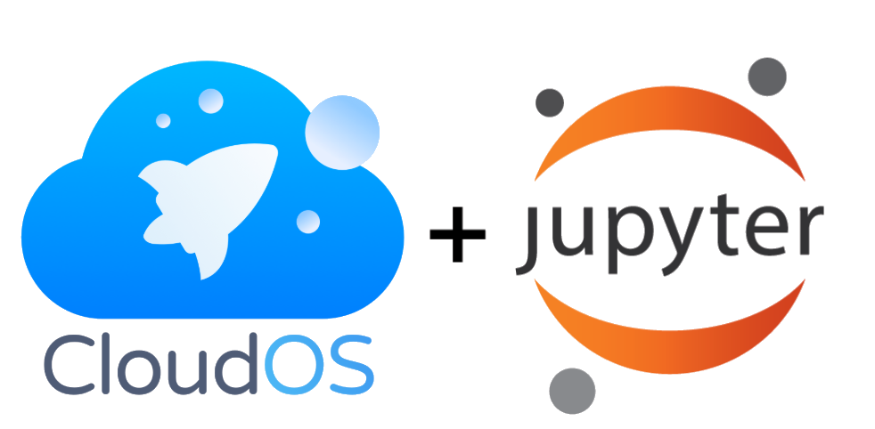

  

## Jupyter for Jax
*Hands-on workshop material for using Jupyter Notebooks on the CloudOS platform*
   

### Agenda for the day:

| Time        | Programme       |
| ----------- | --------------------------------------------------------------------------- |
| 9:00-9:15   | :wave: Welcome Address - Dr. Anne Deslattes Mays / Dr. Maria Chatzou Dunford       |
| 9:15-9:30   | Demoing the end result                                                      |
| 9:30-10:00  | Introduction to literate programming workflows with Jupyter Notebooks       |
| 10:00-10:10 | Configuration of Jupyter Notebooks on Lifebit CloudOS                       |
| 10:10-11:00 | Exploratory Data Analysis Fundamentals with Pandas in Jupyter Notebooks     |
| 11:00-11:20 | :coffee: _Coffee Break_                                                              |
| 11:20-13:00 | Interactive plotting with R in Jupyter Notebooks                            |
| 13:00-14:00 | :bento: _Lunch_                                                                     |
| 14:00-15:00 | Will it reproduce? Revisiting a publication authored with Jupyter Notebooks |
| 15:00-15:20 | :coffee: _Coffee Break_                                                              |
| 16:00-16:45 | Integrative Genomics Viewer on Lifebit CloudOS                              |
| 16:50-17:00 | :wave: _Closing Remarks_                                                           |

### Introduction

#### Configuration of Jupyter Notebooks on Lifebit CloudOS

Installing packages
- with `conda`
- with `pip`

### Jupyter Shortcuts Cheatsheet

WIP: Create markdown table for the most handy ones, here is a good place to start: http://maxmelnick.com/2016/04/19/python-beginner-tips-and-tricks.html

### Exploratory Data Analysis Fundamentals with Pandas   

Pandas is an excellent python library that simplifies basic data handling tasks for dataframes. In this part, we will explore a well known dataset, `iris`, and we will learn how to perform basic data cleaning and handling operations using pandas utilities along with python build in functions. We will use Pandas to read tabular files in a dataframe, inspect the dimensions, variable values and number of observations, create subsets of our data based on column and row filtering criteria and retrieve summary statistics for our dataset. In the end of this part, we will have created a basic exporatory data analysis workflow for performing a minimal data quality control routine.

#### Utils

Basic built-in functions and methods that we will use:

- `.type()`
- `.describe()`
- `.shape()`
- `.DataFrame()`

### Interactive plotting with R in Jupyter Notebooks

For the second part of the workshop, we will switch to R to explore the great functionalities of `ggplot2` and related R packages for publication ready plots. We will first create a suitable input table with helper variable to facilitate the plotting. We will explore the ggplot layers and customise different aesthetics to  create publication ready plots. Finally, we will add interactivity to our plots by using the `plotly` library. We will also explore two extremely handy R packages, `ggpubr` and 

### Will it reproduce? Revisiting a publication authored with Jupyter Notebooks

What does it take to submit a fully reproducible research piece? Notebooks, Jupyter Notebooks or Rmarkdown documents for example, have been proposed as a promising solution to accompany and bundle together in a reproducible report all the supplementary data of an scientific analysis that get published. Enabling other researchers reproduce our published work, offers the possibility of Postpublication Peer Review. During the Open Data Day 2017, hosted by SPARC and the NIH, within the two-day hackathon organised, an attempt to analyse [all Jupyter notebooks mentioned in PubMed Central](https://github.com/sparcopen/open-research-doathon/issues/25) started, with many contributors from the open source community, including [Daniel Mietchen](https://github.com/Daniel-Mietchen). Thanks to this initiative, a collection of metadata for publications including Jupyter Notebooks was created. At the time, approximately 100 publications from EuropePMC, which included Jupyter Notebooks to assist with reproducibility of their analysis were documented. Our goal for this part of the workshop is to select a publication with a Jupyter Notebook, and try to reproduce the analysis. The objective of this part is to realise the minimal requirements of a reproducible workflow and hopefully explore the literate programming workflow of the publication authors. The repository where this effort was coordinated can be found here: https://github.com/sparcopen/open-research-doathon. A relevant JupyterCon talk by [Daniel Mietchen](https://github.com/Daniel-Mietchen) can be also found here: https://youtu.be/Via7gBrjxHI

Plan:

- Find the repository of the publication with the accomodating Jupyter Notebook
- Go to our CloudOS Jupyter Notebook session and `git clone` the repository
- Launch the `.ipynb` file and start exploring
- Troubleshoot as needed and note difficulties in reproducing the analysis
- Make an issue and file the problems we have noticed

### Integrative Genomics Viewer on Lifebit CloudOS  

Moving on to our last part of our tutorial, we will learn how to use Integrative Genomics Viewer (IGV) on the CloudOS platform and easily connect data from . Typically to use IGV, the minimal requirements are a laptop preferably with at least 4Gb of RAM and a registration procedure to fill in the respective form to get access to IGV. Additionally, data can be loaded only if available locally which places limitations in data size, especially when working with large files (cohort VCF, BAM). More details about the prerequisites to use IGV locally can be found in the [IGV User Guide](http://www.broadinstitute.org/software/igv/UserGuide) .  Contrary to the usual configuration required to use IGV, there are no prerequisites or installation steps to use IGV on CloudOS, nor the need to copy data. To access data we will simply link the data from our cloud storage provider and continue with the IGV analysis.

